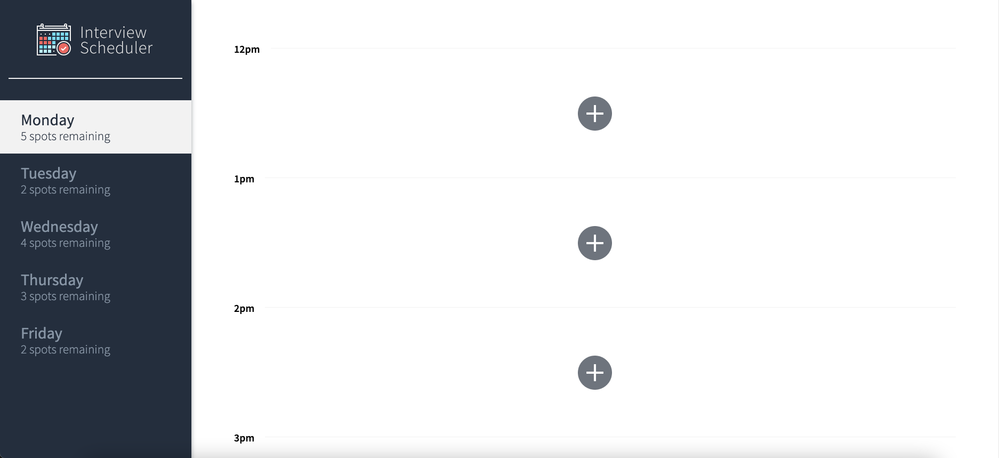
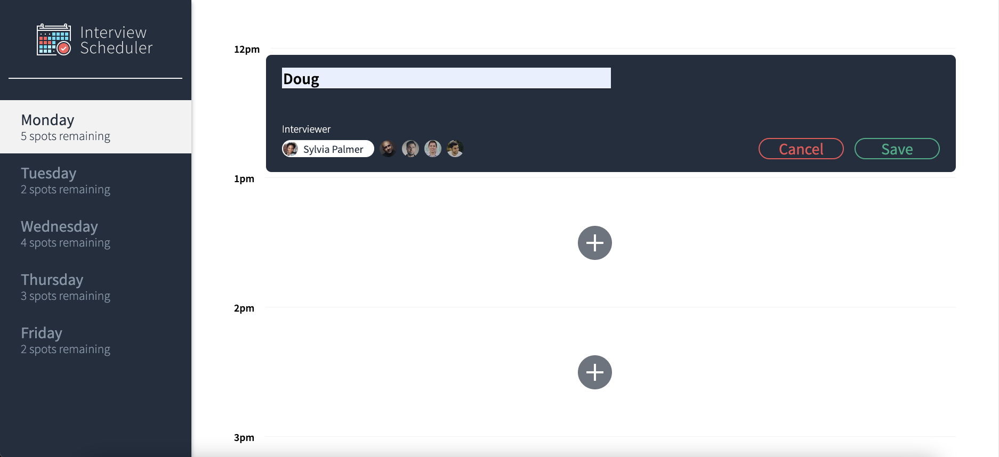
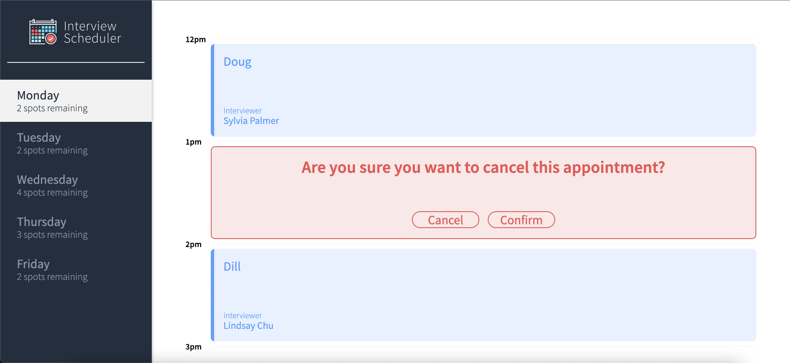

# Interview Scheduler

Interview scheduler is a project that allows users to create and schedule an interview by choosing a day, a time, and an interviewer. Appointments can be edited, or cancelled after creation through the app. Appointments can also be reviewed by selecting the desired day.

## Setup

Install dependencies with `npm install`.

## Running Webpack Development Server

```sh
npm start
```

## Running Jest Test Framework

```sh
npm test
```

## Running Storybook Visual Testbed

```sh
npm run storybook
```

## Screenshots of Project



